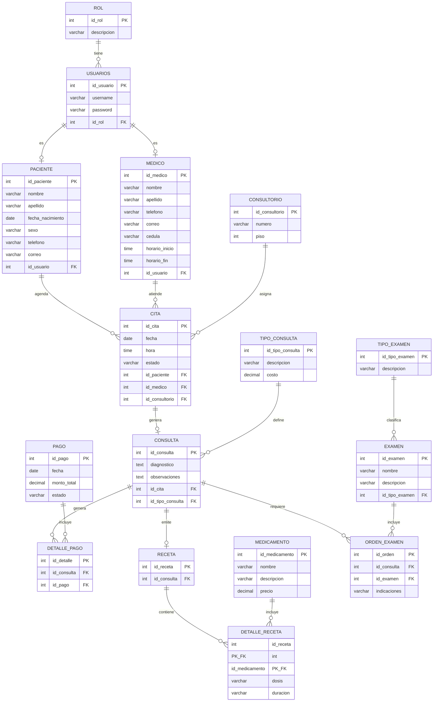

```mermaid
erDiagram
    ROL {
        int id_rol PK
        varchar descripcion
    }
    
    USUARIOS {
        int id_usuario PK
        varchar username
        varchar password
        int id_rol FK
    }
    
    TIPO_CONSULTA {
        int id_tipo_consulta PK
        varchar descripcion
        decimal costo
    }
    
    PACIENTE {
        int id_paciente PK
        varchar nombre
        varchar apellido
        date fecha_nacimiento
        varchar sexo
        varchar telefono
        varchar correo
        int id_usuario FK
    }
    
    MEDICO {
        int id_medico PK
        varchar nombre
        varchar apellido
        varchar telefono
        varchar correo
        varchar cedula
        time horario_inicio
        time horario_fin
        int id_usuario FK
    }
    
    CONSULTORIO {
        int id_consultorio PK
        varchar numero
        int piso
    }
    
    CITA {
        int id_cita PK
        date fecha
        time hora
        varchar estado
        int id_paciente FK
        int id_medico FK
        int id_consultorio FK
    }
    
    CONSULTA {
        int id_consulta PK
        text diagnostico
        text observaciones
        int id_cita FK
        int id_tipo_consulta FK
    }
    
    PAGO {
        int id_pago PK
        date fecha
        decimal monto_total
        varchar estado
    }
    
    DETALLE_PAGO {
        int id_detalle PK
        int id_consulta FK
        int id_pago FK
    }
    
    RECETA {
        int id_receta PK
        int id_consulta FK
    }
    
    MEDICAMENTO {
        int id_medicamento PK
        varchar nombre
        varchar descripcion
        decimal precio
    }
    
    DETALLE_RECETA {
        int id_receta PK_FK
        int id_medicamento PK_FK
        varchar dosis
        varchar duracion
    }
    
    EXAMEN {
        int id_examen PK
        varchar nombre
        varchar descripcion
        int id_tipo_examen FK
    }
    
    TIPO_EXAMEN {
        int id_tipo_examen PK
        varchar descripcion
    }
    
    ORDEN_EXAMEN {
        int id_orden PK
        int id_consulta FK
        int id_examen FK
        varchar indicaciones
    }

    %% Relaciones
    ROL ||--o{ USUARIOS : "tiene"
    USUARIOS ||--o| PACIENTE : "es"
    USUARIOS ||--o| MEDICO : "es"
    PACIENTE ||--o{ CITA : "agenda"
    MEDICO ||--o{ CITA : "atiende"
    CONSULTORIO ||--o{ CITA : "asigna"
    CITA ||--o| CONSULTA : "genera"
    TIPO_CONSULTA ||--o{ CONSULTA : "define"
    CONSULTA ||--o{ DETALLE_PAGO : "genera"
    PAGO ||--o{ DETALLE_PAGO : "incluye"
    CONSULTA ||--o| RECETA : "emite"
    RECETA ||--o{ DETALLE_RECETA : "contiene"
    MEDICAMENTO ||--o{ DETALLE_RECETA : "incluye"
    CONSULTA ||--o{ ORDEN_EXAMEN : "requiere"
    EXAMEN ||--o{ ORDEN_EXAMEN : "incluye"
    TIPO_EXAMEN ||--o{ EXAMEN : "clasifica"
```
