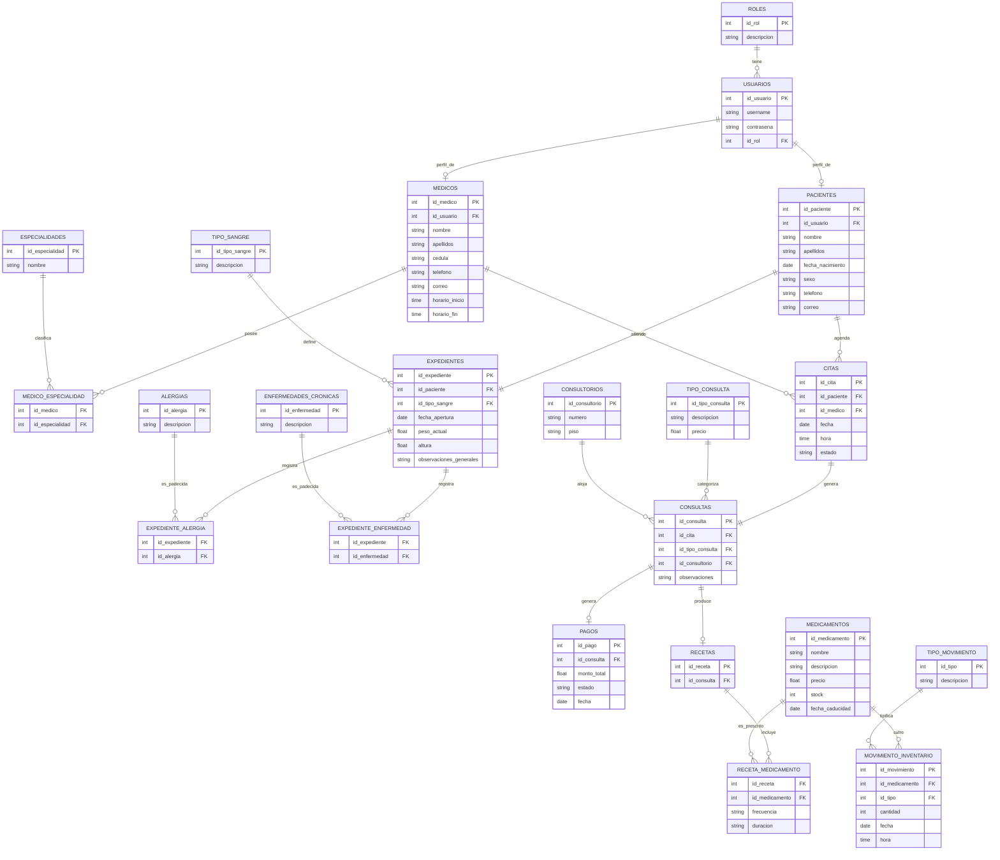

```mermaid
erDiagram
    ROLES {
        int id_rol PK
        string descripcion
    }

    USUARIOS {
        int id_usuario PK
        string username
        string contrasena
        int id_rol FK
    }

    PACIENTES {
        int id_paciente PK
        int id_usuario FK
        string nombre
        string apellidos
        date fecha_nacimiento
        string sexo
        string telefono
        string correo
    }

    MEDICOS {
        int id_medico PK
        int id_usuario FK
        string nombre
        string apellidos
        string cedula
        string telefono
        string correo
        time horario_inicio
        time horario_fin
    }

    ESPECIALIDADES {
        int id_especialidad PK
        string nombre
    }

    MEDICO_ESPECIALIDAD {
        int id_medico FK
        int id_especialidad FK
    }

    TIPO_SANGRE {
        int id_tipo_sangre PK
        string descripcion
    }

    EXPEDIENTES {
        int id_expediente PK
        int id_paciente FK
        int id_tipo_sangre FK
        date fecha_apertura
        float peso_actual
        float altura
        string observaciones_generales
    }

    ALERGIAS {
        int id_alergia PK
        string descripcion
    }

    EXPEDIENTE_ALERGIA {
        int id_expediente FK
        int id_alergia FK
    }

    ENFERMEDADES_CRONICAS {
        int id_enfermedad PK
        string descripcion
    }

    EXPEDIENTE_ENFERMEDAD {
        int id_expediente FK
        int id_enfermedad FK
    }

    CITAS {
        int id_cita PK
        int id_paciente FK
        int id_medico FK
        date fecha
        time hora
        string estado
    }

    TIPO_CONSULTA {
        int id_tipo_consulta PK
        string descripcion
        float precio
    }

    CONSULTORIOS {
        int id_consultorio PK
        string numero
        string piso
    }

    CONSULTAS {
        int id_consulta PK
        int id_cita FK
        int id_tipo_consulta FK
        int id_consultorio FK
        string observaciones
    }

    PAGOS {
        int id_pago PK
        int id_consulta FK
        float monto_total
        string estado
        date fecha
    }

    RECETAS {
        int id_receta PK
        int id_consulta FK
    }

    MEDICAMENTOS {
        int id_medicamento PK
        string nombre
        string descripcion
        float precio
        int stock
        date fecha_caducidad
    }

    RECETA_MEDICAMENTO {
        int id_receta FK
        int id_medicamento FK
        string frecuencia
        string duracion
    }

    TIPO_MOVIMIENTO {
        int id_tipo PK
        string descripcion
    }

    MOVIMIENTO_INVENTARIO {
        int id_movimiento PK
        int id_medicamento FK
        int id_tipo FK
        int cantidad
        date fecha
        time hora
    }

    %% Relaciones de Control de Acceso
    ROLES ||--o{ USUARIOS : "tiene"
    USUARIOS ||--o| MEDICOS : "perfil_de"
    USUARIOS ||--o| PACIENTES : "perfil_de"

    %% Relaciones de Médicos y Especialidades
    MEDICOS ||--o{ MEDICO_ESPECIALIDAD : "posee"
    ESPECIALIDADES ||--o{ MEDICO_ESPECIALIDAD : "clasifica"

    %% Relaciones de Historial Clínico
    PACIENTES ||--|| EXPEDIENTES : "tiene"
    TIPO_SANGRE ||--o{ EXPEDIENTES : "define"
    EXPEDIENTES ||--o{ EXPEDIENTE_ALERGIA : "registra"
    ALERGIAS ||--o{ EXPEDIENTE_ALERGIA : "es_padecida"
    EXPEDIENTES ||--o{ EXPEDIENTE_ENFERMEDAD : "registra"
    ENFERMEDADES_CRONICAS ||--o{ EXPEDIENTE_ENFERMEDAD : "es_padecida"

    %% Relaciones de Flujo de Atención
    PACIENTES ||--o{ CITAS : "agenda"
    MEDICOS ||--o{ CITAS : "atiende"
    CITAS ||--|| CONSULTAS : "genera"
    TIPO_CONSULTA ||--o{ CONSULTAS : "categoriza"
    CONSULTORIOS ||--o{ CONSULTAS : "aloja"
    
    %% Relaciones de Facturación
    CONSULTAS ||--o| PAGOS : "genera"

    %% Relaciones de Farmacia y Recetas
    CONSULTAS ||--o| RECETAS : "produce"
    RECETAS ||--o{ RECETA_MEDICAMENTO : "incluye"
    MEDICAMENTOS ||--o{ RECETA_MEDICAMENTO : "es_prescrito"

    %% Relaciones de Inventario
    MEDICAMENTOS ||--o{ MOVIMIENTO_INVENTARIO : "sufre"
    TIPO_MOVIMIENTO ||--o{ MOVIMIENTO_INVENTARIO : "tipifica"
```
